# dispatch

**Automated EFI workload orchestration**

`dispatch` automates bare-metal testing workflows. It does the following:

1. downloads metadata of dispatch-enabled workloads from GitHub release assets
2. manages the queue of workloads and workload execution state
3. offers workload download over HTTP for HTTP boot clients
4. files GitHub issues with workload execution results

For full details, see below.

## Quick Start

```bash
# Authenticate with GitHub
gh auth login

# Run with GitHub repository
dispatch --owner AMDEPYC --repo snpcert --tag latest
```

## How It Works

```mermaid
sequenceDiagram
    participant G as github
    participant D as dispatch
    participant S as server
    participant W as workload
    participant B as beacon

    Note over D: 🚀 MANUAL: Start dispatch
    D->>G: list assets
    G->>D: asset list
    D->>D: filter asset list
    D->>D: create execution queue
    D->>D: start http server
    
    Note over S: ⚙️ MANUAL: Configure HTTP Boot URL
    Note over S: 🔌 MANUAL: Power on server
    S->>S: power on

    loop For each workload
        S->>D: get size of next workload (HTTP HEAD)
        D->>D: workload moves to 📌 state (assigned)
        D->>S: size of next workload
        S->>S: allocate memory

        S->>D: get next workload (HTTP GET)
        alt Workload available
            D->>D: workload moves to 📥 state (downloading)
            D->>S: next workload
            S->>W: boot workload
            
            W->>B: beacon boot
            B->>D: notify that workload has started
            D->>D: workload moves to ⚡ state (booting)

            W->>W: run tests
            W->>W: collect test results
            W->>B: beacon report ...
            B->>D: report test results
            D->>D: workload moves to 📝 state (reported)
            D->>G: create github issue with test results
            D->>D: workload moves to 🏁 state (finished)

            W->>S: reboot
        else No workloads remaining
            D->>S: poweroff.efi (shutdown workload)
            S->>S: power off
        end
    end
```



## Core Features

- **GitHub Integration**: Automatically loads assets from GitHub releases
- **HTTP Boot Server**: Standards-compliant HTTP boot for bare metal
- **Job Queue Management**: Tracks workload assignment and execution state
- **Automated Reporting**: Creates GitHub issues from workload results
- **Service Discovery**: mDNS broadcast for network discoverability
- **Opt-in Deployment**: Only assets with dispatch content types are deployed

## Asset Filtering and Content Types

`dispatch` uses an **opt-in** deployment model through custom content types.
Only assets explicitly tagged with dispatch-specific content types will be
deployed, allowing repositories to control which workloads participate in
automated testing.

### Dispatch Content Types

The following content types are recognized by dispatch:

| Dispatch Content-Type          | Translated to...          | Description              |
|--------------------------------|---------------------------|--------------------------|
| `application/vnd.dispatch+efi` | `application/efi`         | EFI modules/applications |
| `application/vnd.dispatch+iso` | `application/vnd.efi-iso` | ISO disk images          |
| `application/vnd.dispatch+img` | `application/vnd.efi-img` | Ramdisk images           |

### Example

| Asset Name | Asset Content-Type             | Dispatched as...          |
|------------|--------------------------------|---------------------------|
| `foo.iso`  | `application/vnd.dispatch+iso` | `application/vnd.efi-iso` |
| `qux.iso`  | `application/vnd.efi-iso`      | **ignored**               |
| `bar.efi`  | `application/vnd.dispatch+efi` | `application/efi`         |
| `baz.efi`  | `application/octet-stream`     | **ignored**               |

Only files with the `application/vnd.dispatch+*` content types will be included in the dispatch queue.

## Workflow States

Each workload progresses through these states:

1. **⏳ Unassigned** → Available for assignment
2. **📌 Assigned** → Reserved for specific server IP
3. **📥 Downloading** → Server fetching workload
4. **⚡ Booting** → Workload is booting (via `beacon boot`)
5. **📝 Reported** → Results submitted (via `beacon report`)
6. **🏁 Finished/Failed** → Final state

## Usage Examples

### Basic Usage
```bash
# Serve all dispatch-enabled assets from latest release
dispatch --owner AMDEPYC --repo snpcert --tag latest

# Filter which dispatch-enabled assets to run by name
dispatch --owner AMDEPYC --repo snpcert --tag latest ubuntu-24.04
```

**Note**: Only assets with supported dispatch content types will be loaded, regardless of filtering options.

## Exit Codes

- `0`: Normal shutdown (press 'q')
- `1`: Authentication failure or network error

## Minimum Supported Rust Version (MSRV)

Rust 1.70+

---

**License**: MIT  
**Repository**: https://github.com/AMDEPYC/snpcert
